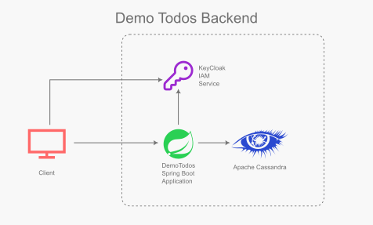

# Demo Todos Backend application
This is a spring boot application for backend of "Demo Todos" application. It exposes REST API to do CRUD operations on Todo items.

# Architecture


## Database and stores
The application uses [Apache Cassandra](https://cassandra.apache.org/) noSQL database to store Todo items with following properties:
* `user_id` (Primary key)
* `todo_id` (Sort key)
* `due_date`
* `title`
* `description`
* `done`

Its a basic schema on which an efficient CRUD API for Todos is built.

## REST APIs
REST APIs are implemented in [Java](https://www.java.com/) using [Spring Boot](https://spring.io/projects/spring-boot).

## API Documentation
API is documented using [Open API](https://www.openapis.org/what-is-openapi) specs.

## Security
It uses [KeyCloak](https://www.keycloak.org/) as IAM server.

# Local testing
## Build the app
```sh
mvn clean package
```

## Start dependency containers
Start
```sh
# First time
docker compose up -d

# Start a previously stopped state
docker compose start
```

Stop
```sh
# Stopping to preserve state
docker compose stop

# Destroy state
docker compose down
```
## Create keyspace
```sh
CREATE KEYSPACE demotodos
   WITH replication = {'class': 'SimpleStrategy', 'replication_factor' : 1};
```

## Import security config
When running for first time or after destroying KeyCloak container, import the realm config located at `config/realm-config.json` into KeyCloak server. This will create following users:
- User = `alice`, Password = `alice`
- User = `jdoe`, Password = `jdoe`

JWT Tokens for these users can be obtained by running (example is for `jdoe`):
```sh
export access_token=$(\
curl -X POST http://localhost:7070/realms/demotodos/protocol/openid-connect/token \
-H 'content-type: application/x-www-form-urlencoded' \
-d 'client_id=authz-servlet&client_secret=secret' \
-d 'username=jdoe&password=jdoe&grant_type=password' | jq --raw-output '.access_token' \
)
```

## Run the app
```sh
java -jar target/demo-todos-0.0.1.SNAPSHOT.jar
```

## Test the endpoints
While testing the endpoints, pass in Bearer Authentication JWT token (obtained above) to authenticate the user.

Postman collection with some samples is located in `e2e-test/`
